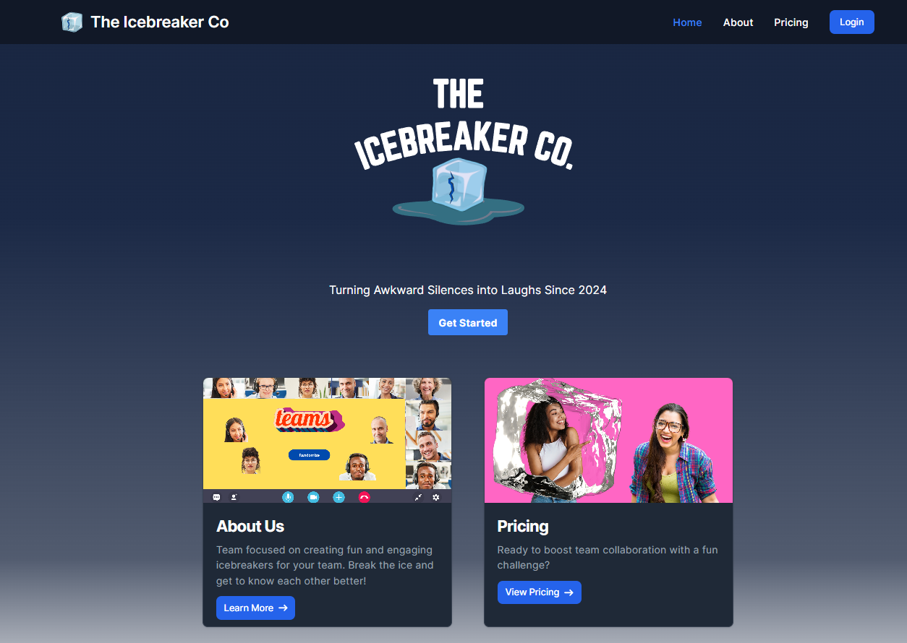
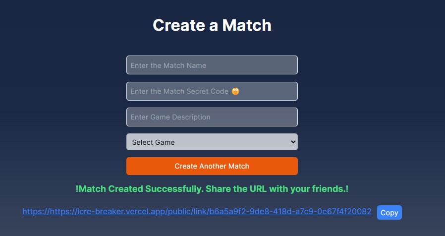

<a id="readme-top"></a>

<h1 align="center">Ice Breaker App</h1>

<div align="center">

App built by [Claudia](https://github.com/Fl4utia/) & me at a [HeadStarter fellowship Hackathon](https://headstarter.co/). ⚡
See [the project demonstration at youtube](https://www.youtube.com/watch?v=_u_-baDNG0o) 


</div>

<div align="center">
    
    
    
    
</div>

<div align="center">

Welcome to IceBreaker 🧊🥶, the app designed to make networking, improve social interaction, and events both fun and effortless 👨‍🏭🧕. Our vision is to create a relaxed environment where participants can easily connect through interactive games, similar to Kahoot. IceBreaker breaks down social barriers, encourages open communication, and fosters genuine connections among users.

Users create game links and share them publicly, with access granted via secret codes, allowing anyone with the code to join and engage. By facilitating playful interactions and learning about each other’s interests, IceBreaker helps build a more collaborative and inclusive atmosphere. Dive into IceBreaker and make your next event a memorable, connection-rich experience/ ⚡




</div> 

## Prerequisites

1. Node.js
2. Npm or yarn or pnpm
3. MySQL

## Getting Started

First, create a `.env.local` file in the root directory of the project and add the following environment variables:

```bash
DB_HOST=localhost
DB_USER=root
DB_PASSWORD=password
DB_NAME=nextjs

NEXT_PUBLIC_API_URL=http://localhost:3000/api
JWT_SECRET=your_secret_key
```

Note: Replace `your_secret_key` with a random string of characters. This can be achieved by running the following command in the terminal:

```bash
node -e "console.log(require('crypto').randomBytes(32).toString('hex'))"
# or
openssl rand -hex 32
```

Then, run the development server:

```bash
npm run dev
# or
yarn dev
# or
pnpm dev
# or
bun dev
```

Open [http://localhost:3000](http://localhost:3000) with your browser to see the result.
